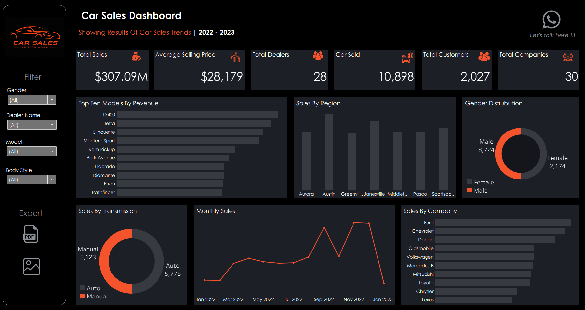
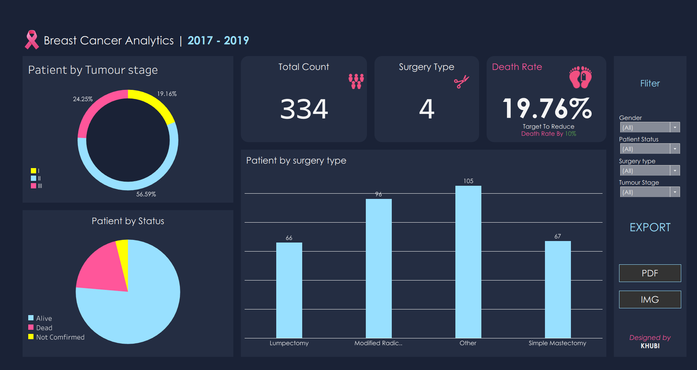
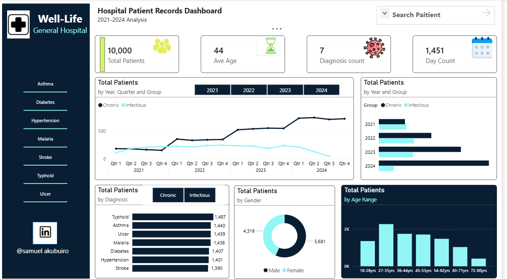
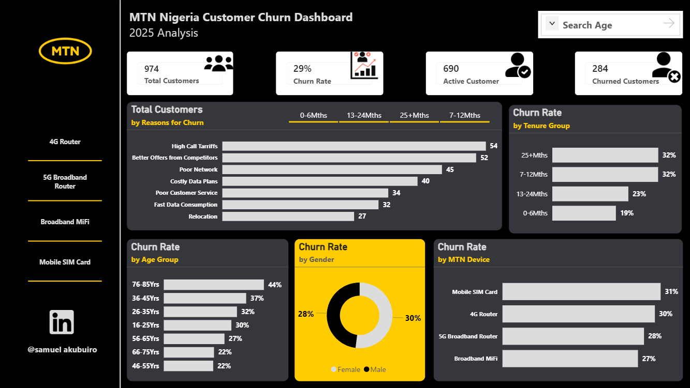

Akubuiro Samuel Ikechukwu

Data Analyst Portfolio

Welcome to my Data Analyst portfolio. This repository showcases projects I have completed using SQL, Power BI, Tableau, Power Query, and Excel to solve real-world business problems.

About Me

I am an aspiring Data Analyst with a passion for transforming data into actionable insights. I enjoy cleaning data, building dashboards, and analyzing business performance to support data-driven decision-making.

Skills

* SQL
* Power BI
* Tableau
* Power Query
* Microsoft Excel
* Data Cleaning
* Data Visualization

Projects

Automotive Sales Dashboard

Tools: SQL, Tableau

* Analyzed vehicle sales performance.
* Identified top-performing brands and customer purchasing trends.
* Created an interactive Tableau dashboard.

Sales Performance Dashboard

Tools: SQL, Tableau

* Tracked sales KPIs.
* Compared regional performance.
* Developed an interactive dashboard for business reporting.

Breast Cancer Dashboard

Tools: SQL, Tableau

* Analyzed breast cancer data to identify key patterns and trends.
* Built an interactive dashboard for data exploration and reporting.
* Presented insights to support healthcare analysis and decision-making.

Well-Life General Hospital Dashboard

Tools: Power Query, Power BI

* Prepared and transformed hospital data for reporting.
* Built an interactive Power BI dashboard to monitor healthcare metrics.
* Analyzed operational trends to support hospital decision-making.

MTN Customer Churn Analysis

Tools: Power Query, Power BI

* Cleaned and transformed customer data.
* Built an interactive dashboard.
* Analyzed customer churn trends and key drivers.

Emerald Properties Dashboard

Tools: Excel, Power Query

* Cleaned and transformed property data for analysis.
* Built a dashboard to track property performance and trends.
* Used Excel and Power Query to organize and visualize key insights.

Certifications

* Skill Ahead – Execl and Power BI Certificate (May 2026)
* Skill Ahead – SQL and Tableau Certificate (July 2026)

Contact

* Email: akubuirosam@gmail.com
* LinkedIn: https:www.linkedin.com/in/samuel-akubuiro-35a276285
